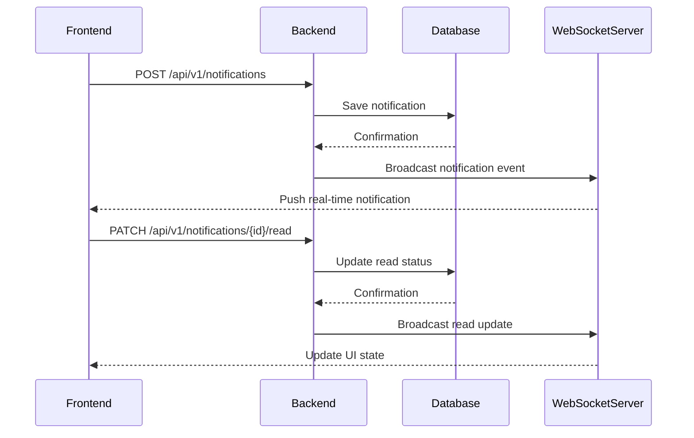
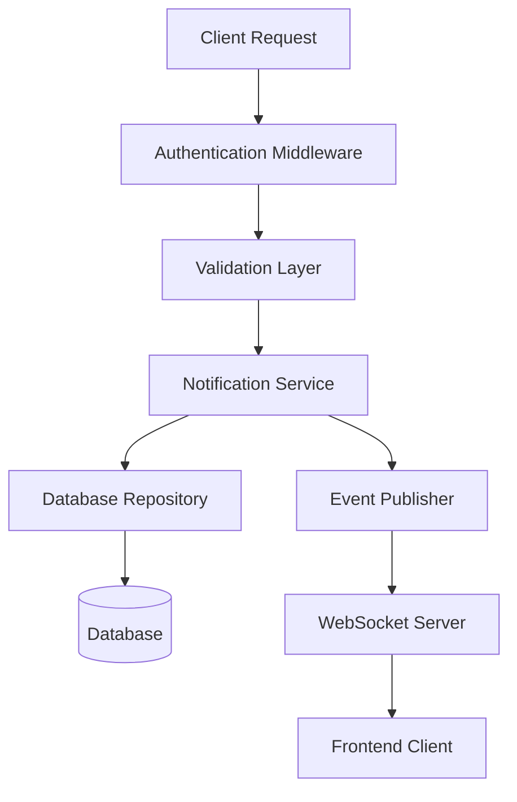
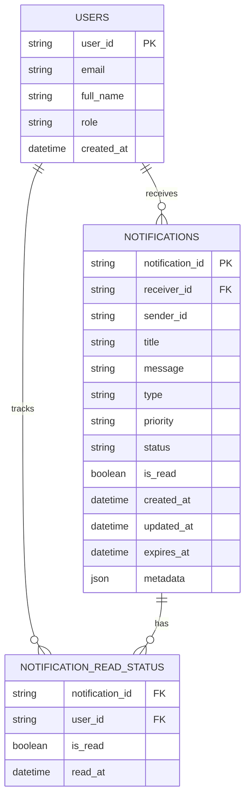

# Stage 1

## 1. Introduction

The Notification Platform is a production-ready backend service designed to deliver timely, secure, and scalable notifications to authenticated users across web and mobile applications. The system supports real-time notifications, persistent storage, filtering, search, and read-state management, enabling seamless user engagement for events such as placements, results, reminders, and system alerts.

## 2. Core Features

The platform supports the following notification operations:

- Create Notification
- Get All Notifications
- Get Notification By ID
- Mark Notification as Read
- Mark All Notifications as Read
- Delete Notification
- Delete All Read Notifications
- Get Unread Notifications
- Count Unread Notifications
- Filter Notifications
- Search Notifications

## 3. REST API Design

### Base URL

```text
https://api.example.com/api/v1
```

### 1) Create Notification

- HTTP Method: POST
- Endpoint URL: /api/v1/notifications
- Purpose: Create a new notification for a specific user or a user group.
- Request Headers:
  - Content-Type: application/json
  - Accept: application/json
  - Authorization: Bearer <token>
  - Correlation-ID: <uuid>
- Request Parameters: None
- Request Body:

```json
{
  "title": "Placement Drive Reminder",
  "message": "Placement drive starts at 10:00 AM tomorrow.",
  "type": "placement",
  "priority": "high",
  "receiver": "user-123",
  "metadata": {
    "campaign": "campus-recruitment",
    "link": "https://example.com/placement"
  }
}
```

- Success Response:

```json
{
  "success": true,
  "data": {
    "notificationId": "notif_001",
    "title": "Placement Drive Reminder",
    "message": "Placement drive starts at 10:00 AM tomorrow.",
    "type": "placement",
    "priority": "high",
    "status": "sent",
    "isRead": false,
    "sender": "system",
    "receiver": "user-123",
    "createdAt": "2026-06-25T10:30:00Z",
    "updatedAt": "2026-06-25T10:30:00Z",
    "expiresAt": "2026-06-27T10:30:00Z",
    "metadata": {
      "campaign": "campus-recruitment",
      "link": "https://example.com/placement"
    }
  }
}
```

- Error Response:

```json
{
  "success": false,
  "error": {
    "code": "VALIDATION_ERROR",
    "message": "Receiver is required."
  }
}
```

- HTTP Status Codes: 201, 400, 401, 403, 422, 500

### 2) Get All Notifications

- HTTP Method: GET
- Endpoint URL: /api/v1/notifications
- Purpose: Retrieve notifications for the authenticated user.
- Request Headers:
  - Accept: application/json
  - Authorization: Bearer <token>
  - Correlation-ID: <uuid>
- Request Parameters:
  - page (optional)
  - limit (optional)
  - type (optional)
  - status (optional)
  - isRead (optional)
- Request Body: None
- Success Response:

```json
{
  "success": true,
  "data": {
    "items": [
      {
        "notificationId": "notif_001",
        "title": "Placement Drive Reminder",
        "message": "Placement drive starts at 10:00 AM tomorrow.",
        "type": "placement",
        "priority": "high",
        "status": "sent",
        "isRead": false,
        "sender": "system",
        "receiver": "user-123",
        "createdAt": "2026-06-25T10:30:00Z",
        "updatedAt": "2026-06-25T10:30:00Z",
        "expiresAt": "2026-06-27T10:30:00Z",
        "metadata": {}
      }
    ],
    "page": 1,
    "limit": 20,
    "total": 1
  }
}
```

- Error Response:

```json
{
  "success": false,
  "error": {
    "code": "UNAUTHORIZED",
    "message": "Authentication token is invalid."
  }
}
```

- HTTP Status Codes: 200, 401, 403, 500

### 3) Get Notification By ID

- HTTP Method: GET
- Endpoint URL: /api/v1/notifications/{id}
- Purpose: Retrieve a specific notification by its ID.
- Request Headers:
  - Accept: application/json
  - Authorization: Bearer <token>
  - Correlation-ID: <uuid>
- Request Parameters:
  - id (required, path parameter)
- Request Body: None
- Success Response:

```json
{
  "success": true,
  "data": {
    "notificationId": "notif_001",
    "title": "Placement Drive Reminder",
    "message": "Placement drive starts at 10:00 AM tomorrow.",
    "type": "placement",
    "priority": "high",
    "status": "sent",
    "isRead": false,
    "sender": "system",
    "receiver": "user-123",
    "createdAt": "2026-06-25T10:30:00Z",
    "updatedAt": "2026-06-25T10:30:00Z",
    "expiresAt": "2026-06-27T10:30:00Z",
    "metadata": {}
  }
}
```

- Error Response:

```json
{
  "success": false,
  "error": {
    "code": "NOT_FOUND",
    "message": "Notification not found."
  }
}
```

- HTTP Status Codes: 200, 401, 403, 404, 500

### 4) Mark Notification as Read

- HTTP Method: PATCH
- Endpoint URL: /api/v1/notifications/{id}/read
- Purpose: Update the read state of a specific notification.
- Request Headers:
  - Authorization: Bearer <token>
  - Content-Type: application/json
  - Accept: application/json
  - Correlation-ID: <uuid>
- Request Parameters:
  - id (required, path parameter)
- Request Body: None
- Success Response:

```json
{
  "success": true,
  "data": {
    "notificationId": "notif_001",
    "isRead": true,
    "status": "read",
    "updatedAt": "2026-06-25T10:35:00Z"
  }
}
```

- Error Response:

```json
{
  "success": false,
  "error": {
    "code": "CONFLICT",
    "message": "Notification already marked as read."
  }
}
```

- HTTP Status Codes: 200, 401, 403, 404, 409, 500

### 5) Mark All Notifications as Read

- HTTP Method: PATCH
- Endpoint URL: /api/v1/notifications/read-all
- Purpose: Mark every notification for the authenticated user as read.
- Request Headers:
  - Authorization: Bearer <token>
  - Accept: application/json
  - Correlation-ID: <uuid>
- Request Parameters: None
- Request Body: None
- Success Response:

```json
{
  "success": true,
  "data": {
    "updatedCount": 12,
    "message": "All notifications marked as read."
  }
}
```

- Error Response:

```json
{
  "success": false,
  "error": {
    "code": "SERVER_ERROR",
    "message": "Unable to update notifications."
  }
}
```

- HTTP Status Codes: 200, 401, 403, 500

### 6) Delete Notification

- HTTP Method: DELETE
- Endpoint URL: /api/v1/notifications/{id}
- Purpose: Delete a single notification.
- Request Headers:
  - Authorization: Bearer <token>
  - Accept: application/json
  - Correlation-ID: <uuid>
- Request Parameters:
  - id (required, path parameter)
- Request Body: None
- Success Response:

```json
{
  "success": true,
  "data": {
    "deletedNotificationId": "notif_001",
    "message": "Notification deleted successfully."
  }
}
```

- Error Response:

```json
{
  "success": false,
  "error": {
    "code": "NOT_FOUND",
    "message": "Notification does not exist."
  }
}
```

- HTTP Status Codes: 200, 401, 403, 404, 500

### 7) Delete All Read Notifications

- HTTP Method: DELETE
- Endpoint URL: /api/v1/notifications/read
- Purpose: Remove all notifications already marked as read.
- Request Headers:
  - Authorization: Bearer <token>
  - Accept: application/json
  - Correlation-ID: <uuid>
- Request Parameters: None
- Request Body: None
- Success Response:

```json
{
  "success": true,
  "data": {
    "deletedCount": 6,
    "message": "Read notifications deleted successfully."
  }
}
```

- Error Response:

```json
{
  "success": false,
  "error": {
    "code": "SERVER_ERROR",
    "message": "Unable to delete read notifications."
  }
}
```

- HTTP Status Codes: 200, 401, 403, 500

### 8) Get Unread Notifications

- HTTP Method: GET
- Endpoint URL: /api/v1/notifications/unread
- Purpose: Retrieve all unread notifications for the authenticated user.
- Request Headers:
  - Accept: application/json
  - Authorization: Bearer <token>
  - Correlation-ID: <uuid>
- Request Parameters: None
- Request Body: None
- Success Response:

```json
{
  "success": true,
  "data": {
    "items": [
      {
        "notificationId": "notif_002",
        "title": "Result Published",
        "message": "Your result has been published.",
        "type": "result",
        "priority": "medium",
        "status": "sent",
        "isRead": false,
        "sender": "system",
        "receiver": "user-123",
        "createdAt": "2026-06-25T10:40:00Z",
        "updatedAt": "2026-06-25T10:40:00Z",
        "expiresAt": "2026-06-30T10:40:00Z",
        "metadata": {}
      }
    ]
  }
}
```

- Error Response:

```json
{
  "success": false,
  "error": {
    "code": "UNAUTHORIZED",
    "message": "Authentication failed."
  }
}
```

- HTTP Status Codes: 200, 401, 403, 500

### 9) Count Unread Notifications

- HTTP Method: GET
- Endpoint URL: /api/v1/notifications/count
- Purpose: Get the number of unread notifications.
- Request Headers:
  - Accept: application/json
  - Authorization: Bearer <token>
  - Correlation-ID: <uuid>
- Request Parameters: None
- Request Body: None
- Success Response:

```json
{
  "success": true,
  "data": {
    "unreadCount": 5
  }
}
```

- Error Response:

```json
{
  "success": false,
  "error": {
    "code": "UNAUTHORIZED",
    "message": "Authentication failed."
  }
}
```

- HTTP Status Codes: 200, 401, 403, 500

### 10) Filter Notifications

- HTTP Method: GET
- Endpoint URL: /api/v1/notifications
- Purpose: Filter notifications by type, status, or priority.
- Request Headers:
  - Accept: application/json
  - Authorization: Bearer <token>
  - Correlation-ID: <uuid>
- Request Parameters:
  - type
  - status
  - priority
  - isRead
- Request Body: None
- Success Response:

```json
{
  "success": true,
  "data": {
    "items": [
      {
        "notificationId": "notif_003",
        "title": "Event Reminder",
        "message": "A campus event starts today.",
        "type": "event",
        "priority": "medium",
        "status": "sent",
        "isRead": false,
        "sender": "system",
        "receiver": "user-123",
        "createdAt": "2026-06-25T10:50:00Z",
        "updatedAt": "2026-06-25T10:50:00Z",
        "expiresAt": "2026-06-26T10:50:00Z",
        "metadata": {}
      }
    ]
  }
}
```

- Error Response:

```json
{
  "success": false,
  "error": {
    "code": "INVALID_QUERY",
    "message": "Unsupported filter parameter."
  }
}
```

- HTTP Status Codes: 200, 400, 401, 403, 500

### 11) Search Notifications

- HTTP Method: GET
- Endpoint URL: /api/v1/notifications/search
- Purpose: Search notifications by keyword in title or message.
- Request Headers:
  - Accept: application/json
  - Authorization: Bearer <token>
  - Correlation-ID: <uuid>
- Request Parameters:
  - q (required)
- Request Body: None
- Success Response:

```json
{
  "success": true,
  "data": {
    "items": [
      {
        "notificationId": "notif_004",
        "title": "Result Published",
        "message": "Your result has been published.",
        "type": "result",
        "priority": "medium",
        "status": "sent",
        "isRead": false,
        "sender": "system",
        "receiver": "user-123",
        "createdAt": "2026-06-25T10:55:00Z",
        "updatedAt": "2026-06-25T10:55:00Z",
        "expiresAt": "2026-06-30T10:55:00Z",
        "metadata": {}
      }
    ]
  }
}
```

- Error Response:

```json
{
  "success": false,
  "error": {
    "code": "INVALID_QUERY",
    "message": "Search query is required."
  }
}
```

- HTTP Status Codes: 200, 400, 401, 403, 500

## 4. Notification JSON Schema

### Notification Object

```json
{
  "notificationId": "notif_001",
  "title": "Placement Drive Reminder",
  "message": "Placement drive starts at 10:00 AM tomorrow.",
  "type": "placement",
  "priority": "high",
  "status": "sent",
  "isRead": false,
  "sender": "system",
  "receiver": "user-123",
  "createdAt": "2026-06-25T10:30:00Z",
  "updatedAt": "2026-06-25T10:30:00Z",
  "expiresAt": "2026-06-27T10:30:00Z",
  "metadata": {
    "campaign": "campus-recruitment",
    "link": "https://example.com/placement"
  }
}
```

### Request Model Example

```json
{
  "title": "Result Published",
  "message": "Your semester result is available.",
  "type": "result",
  "priority": "medium",
  "receiver": "user-123",
  "metadata": {
    "source": "student-portal"
  }
}
```

### Response Model Example

```json
{
  "success": true,
  "data": {
    "notificationId": "notif_002",
    "title": "Result Published",
    "message": "Your semester result is available.",
    "type": "result",
    "priority": "medium",
    "status": "sent",
    "isRead": false,
    "sender": "system",
    "receiver": "user-123",
    "createdAt": "2026-06-25T10:40:00Z",
    "updatedAt": "2026-06-25T10:40:00Z",
    "expiresAt": "2026-06-30T10:40:00Z",
    "metadata": {
      "source": "student-portal"
    }
  }
}
```

## 5. Headers

The API should define the following headers:

| Header | Required | Description |
|---|---:|---|
| Content-Type | Yes for POST/PATCH/DELETE requests | Indicates the request body format, typically application/json |
| Accept | Yes | Specifies the response format, typically application/json |
| Authorization | Yes | Bearer token for authenticated access |
| Correlation-ID | Recommended | Unique identifier used to trace requests across services |

## 6. Error Handling

A consistent error format should be used for all API responses.

### Standard Error Response

```json
{
  "success": false,
  "error": {
    "code": "VALIDATION_ERROR",
    "message": "The request payload is invalid.",
    "details": [
      {
        "field": "receiver",
        "issue": "Receiver is required."
      }
    ]
  }
}
```

### Error Examples

#### 400 Bad Request

```json
{
  "success": false,
  "error": {
    "code": "BAD_REQUEST",
    "message": "Malformed request syntax."
  }
}
```

#### 401 Unauthorized

```json
{
  "success": false,
  "error": {
    "code": "UNAUTHORIZED",
    "message": "Authentication token is missing or invalid."
  }
}
```

#### 403 Forbidden

```json
{
  "success": false,
  "error": {
    "code": "FORBIDDEN",
    "message": "You do not have permission to access this resource."
  }
}
```

#### 404 Not Found

```json
{
  "success": false,
  "error": {
    "code": "NOT_FOUND",
    "message": "Notification was not found."
  }
}
```

#### 409 Conflict

```json
{
  "success": false,
  "error": {
    "code": "CONFLICT",
    "message": "Notification is already marked as read."
  }
}
```

#### 422 Unprocessable Entity

```json
{
  "success": false,
  "error": {
    "code": "VALIDATION_ERROR",
    "message": "The request body contains invalid data."
  }
}
```

#### 429 Too Many Requests

```json
{
  "success": false,
  "error": {
    "code": "RATE_LIMITED",
    "message": "Too many requests. Please retry later."
  }
}
```

#### 500 Internal Server Error

```json
{
  "success": false,
  "error": {
    "code": "SERVER_ERROR",
    "message": "An unexpected server error occurred."
  }
}
```

## 7. Real-Time Notification Mechanism

A real-time notification system should push updates to the frontend immediately after the backend creates or updates a notification. WebSockets are preferred because they provide bidirectional, low-latency communication, enabling instant delivery of events such as message alerts, read status updates, and deletion events.

### Why WebSockets are Preferred

- Low latency and real-time delivery
- Persistent connection for efficient event streaming
- Suitable for interactive applications and live dashboards

### Alternatives

- Server-Sent Events (SSE): Good for one-way real-time updates from server to client.
- Long Polling: Simpler to implement but less efficient and slower than WebSockets.

### Connection Flow

1. Client connects to the WebSocket endpoint after authentication.
2. Backend validates the user session.
3. Server subscribes the client to its notification channel.
4. When a new notification is created, the backend broadcasts it to the relevant channel.
5. The frontend receives the event and updates the UI instantly.

## 8. API Naming Standards

- Use lowercase resource names.
- Use plural nouns for collections such as /notifications.
- Use versioning in the URL, such as /api/v1/notifications.
- Use nouns for resources and verbs only for actions where REST semantics require them.
- Prefer clear, consistent, and predictable endpoint naming.

## 9. Security

The notification platform should include the following security controls:

- HTTPS for all API traffic
- Bearer Authentication using JWT or similar access tokens
- Input validation and strict schema enforcement
- Rate limiting to prevent abuse
- CORS configuration for trusted frontend origins
- XSS protection through output encoding and content sanitization
- CSRF protection for cookie-based authentication flows

## 10. Sample API Flow

1. User logs in successfully.
2. Backend creates a notification for the user.
3. Notification is stored in the database.
4. A real-time event is emitted to the WebSocket server.
5. Frontend receives the event and displays the notification in the UI.
6. User marks the notification as read through the API.
7. Backend updates the database and broadcasts the read-state change.

## 11. Sequence Diagram



## 12. Folder Structure

An ideal backend folder structure for the notification module is:

```text
src/
  modules/
    notifications/
      controllers/
      services/
      repositories/
      models/
      validators/
      routes/
      events/
      sockets/
      dto/
      tests/
```

## 13. Best Practices

The notification API should follow these production-ready practices:

- Use versioned REST endpoints
- Apply proper authentication and authorization
- Implement pagination for large result sets
- Add correlation IDs for request tracing
- Use idempotent operations where possible
- Log all important events and failures
- Handle timeouts and retries safely
- Keep payloads lightweight and avoid over-fetching
- Provide consistent error responses
- Use background workers for high-volume delivery jobs when required

---

This document provides an industry-standard API design for the Notification Platform and is ready for submission.

# Stage 2

## 11. Sample Data

The following sample data illustrates how users and notifications can be stored in a relational database.

### Users Table

```sql
INSERT INTO users (user_id, email, full_name, role, created_at) VALUES
('user_001', 'student1@example.com', 'Alice Johnson', 'student', '2026-01-01 09:00:00'),
('user_002', 'student2@example.com', 'Bob Smith', 'student', '2026-01-02 09:00:00'),
('user_003', 'admin@example.com', 'Admin User', 'admin', '2026-01-03 09:00:00');
```

### Notifications Table

```sql
INSERT INTO notifications (
  notification_id,
  receiver_id,
  sender_id,
  title,
  message,
  type,
  priority,
  status,
  is_read,
  created_at,
  updated_at,
  expires_at,
  metadata
) VALUES
(
  'notif_001',
  'user_001',
  'system',
  'Placement Drive Reminder',
  'Placement drive starts at 10:00 AM tomorrow.',
  'placement',
  'high',
  'sent',
  false,
  '2026-06-25 10:30:00',
  '2026-06-25 10:30:00',
  '2026-06-27 10:30:00',
  '{"campaign":"campus-recruitment"}'
),
(
  'notif_002',
  'user_001',
  'system',
  'Result Published',
  'Your result has been published.',
  'result',
  'medium',
  'sent',
  false,
  '2026-06-25 10:40:00',
  '2026-06-25 10:40:00',
  '2026-06-30 10:40:00',
  '{"source":"student-portal"}'
),
(
  'notif_003',
  'user_002',
  'system',
  'Event Reminder',
  'A campus event starts today.',
  'event',
  'medium',
  'sent',
  true,
  '2026-06-25 10:50:00',
  '2026-06-25 10:50:00',
  '2026-06-26 10:50:00',
  '{"location":"auditorium"}'
);
```

### Read Status Table

```sql
INSERT INTO notification_read_status (notification_id, user_id, is_read, read_at) VALUES
('notif_001', 'user_001', false, NULL),
('notif_002', 'user_001', false, NULL),
('notif_003', 'user_002', true, '2026-06-25 11:00:00');
```

## 12. Complete Request Flow

The following describes how the core notification operations work internally.

| Operation | Internal Flow |
|---|---|
| Create Notification | The client sends a POST request to /api/v1/notifications. The API validates the payload, authenticates the user, and creates a notification record in the database. A real-time event is then emitted to the WebSocket server for instant delivery. |
| Store in Database | The backend service validates the request, maps the payload to the notification model, and persists it in the notifications table. Metadata and timestamps are also stored for tracking and lifecycle management. |
| Read Notification | The client requests GET /api/v1/notifications/{id}. The backend verifies authorization, fetches the notification from the database, and returns the current state to the client. |
| Mark Read | The client sends PATCH /api/v1/notifications/{id}/read. The backend updates the is_read flag and read timestamp, then broadcasts the update to the real-time channel if necessary. |
| Delete Notification | The client sends DELETE /api/v1/notifications/{id}. The backend confirms ownership, removes the record from the database, and returns a success response. |

### Internal Sequence



## 13. Best Practices

The following database and API practices are recommended for a production-ready notification system:

- Use indexed columns on receiver_id, created_at, status, and is_read.
- Enforce foreign key constraints between users and notifications.
- Use soft deletes for auditability when deletion must be reversible.
- Store metadata as JSON or a structured document column when flexibility is required.
- Set appropriate TTL or expiration rules for temporary notifications.
- Use transactions for create-and-broadcast workflows where consistency is critical.
- Keep read-state updates atomic and idempotent.
- Use connection pooling and prepared statements for performance.
- Back up notification data regularly and monitor database growth.
- Apply pagination and filtering at the database layer for efficiency.

## ER Diagram



---

This document is now complete as a submission-ready Stage 1 and Stage 2 design package.
